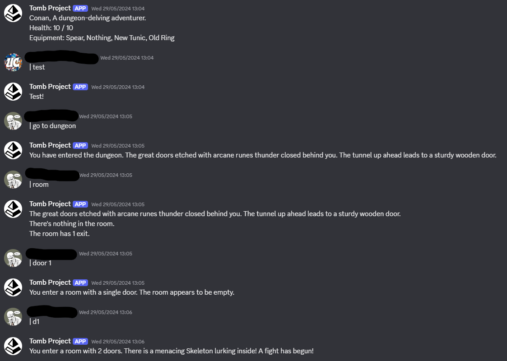
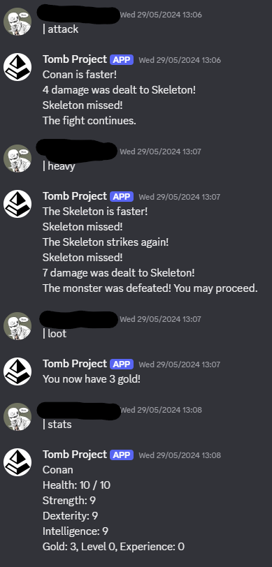

# TombProject
A final-year university project written in Python combined with APIs for Discord and MongoDB.
A choose-your-own adventure story that procedurally generates a dungeon for the character to traverse, using Discord as the interface with text-commands.

